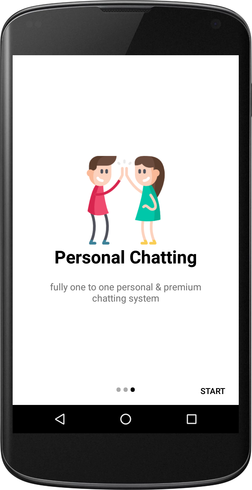
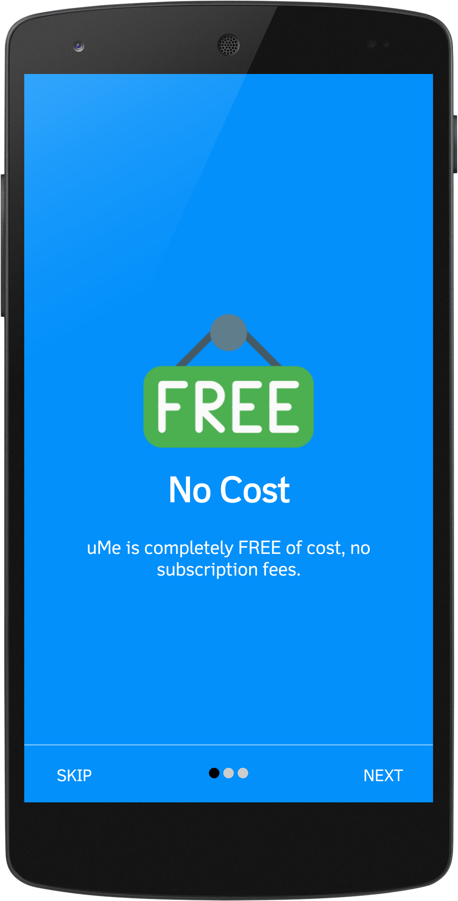
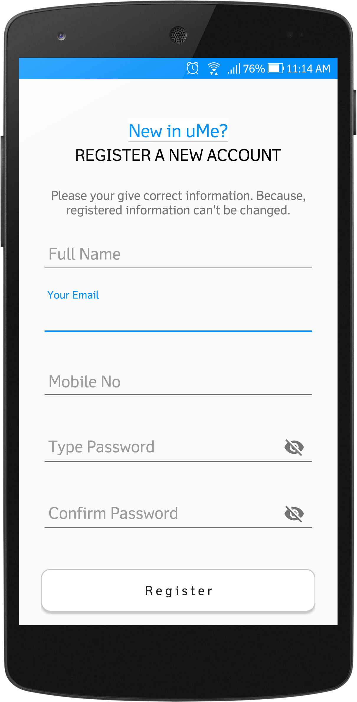
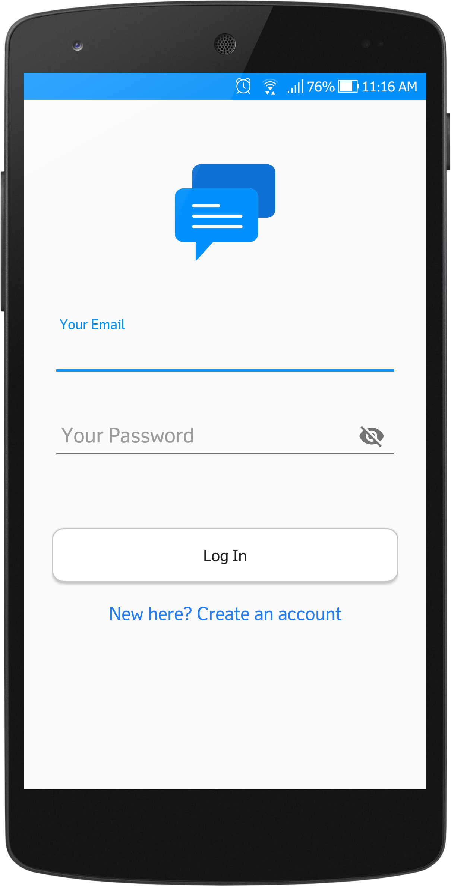
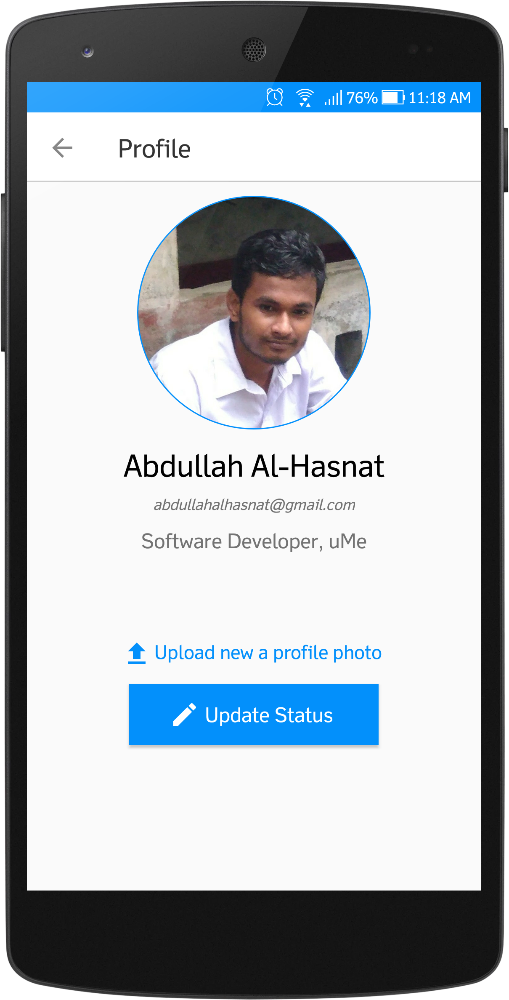

# *uMe*
> _urgent messages_

### App features for learner/developer-
* Splash Screen
* Intro Slider with SharedPreference
* Login, Registration Mechanism with Firebase (with proper validation)
* Works With Firebase AUTHENTICATION, REALTIME DATABASE, STORAGE & CLOUD MESSAGING
* Custom Appbar Design, Custom Alert Dialog Alert (using for logout)
* RecyclerView, Tab layout
* Update registered user profile
* Image upload, Image Cropping, Image Size Copressing (for thumb image)
* Send Friend Request to a person, Cancel, Unfriend and Decline request mechanism
* Offline loading capability (as like Messenger, Whatsaap and others)
* 
* 
* 
* Attractive About us page UI design

>with full UI design

#### Some Screenshots of this app

 Splash Screen                         |  Intro Slider                          |  Registration			              |Login
:-------------------------------------:|:--------------------------------------:|:-----------------------------------:|:-------------------------------------:
  |   ||

 Registered user Profile              | Registered user Profile              | Find/Search Friends                 | Friend Request
:------------------------------------:|:------------------------------------:|:-----------------------------------:|:-------------------------------------:
 | ||

>_university project of_

 
