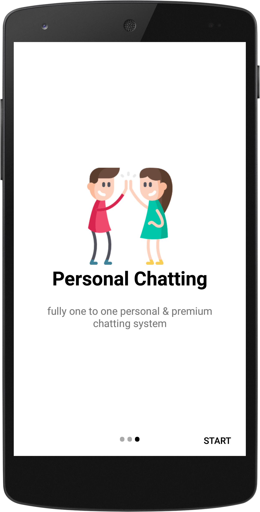

# *uMe*
> _urgent messages_

### features for learner / developer-
* Optimized Splash Screen
* Intro Slider Screen with SharedPreference
* Attractive UI design
* RecyclerView, Tab Layout, Custom Appbar, Custom Alert Dialog (using for logout) and many more
* LOGIN, REGISTRATION, FORGOT PASSWORD mechanism with Firebase (with proper validation)
* Working With Firebase AUTHENTICATION, REALTIME DATABASE, STORAGE & CLOUD MESSAGING
* Update registered user profile
* Image upload, Image Cropping, Image Size Compressing (for thumb image)
* Send Friend Request to a person, Cancel, Unfriend and Decline request mechanism
* Working with NOTIFICATION (in the case of sending friend request)
* Working with Last Seen Time / Online Active Status of Users on Chat Time
* Offline loading capability (as like Messenger, WhatsAap and others)
* Working with different types of Libraries
* Searching Mechanism

>with full UI design

[Download APK](myFiles/uMe.apk)
#### Some Screenshots of this app

 Intro Slider                               | Home                                        | Owner Profile UI 			                    | Friend Request UI 
:------------------------------------------:|:-------------------------------------------:|:-----------------------------------------------:|:----------------------------------------:
  |   ||

 Search a person                           | All Users of uMe                             | When someone send request                       | LIVE CHATTING in uMe
:-----------------------------------------:|:--------------------------------------------:|:-----------------------------------------------:|:-------------------------------------:
 | ||

>_university project of BU_

